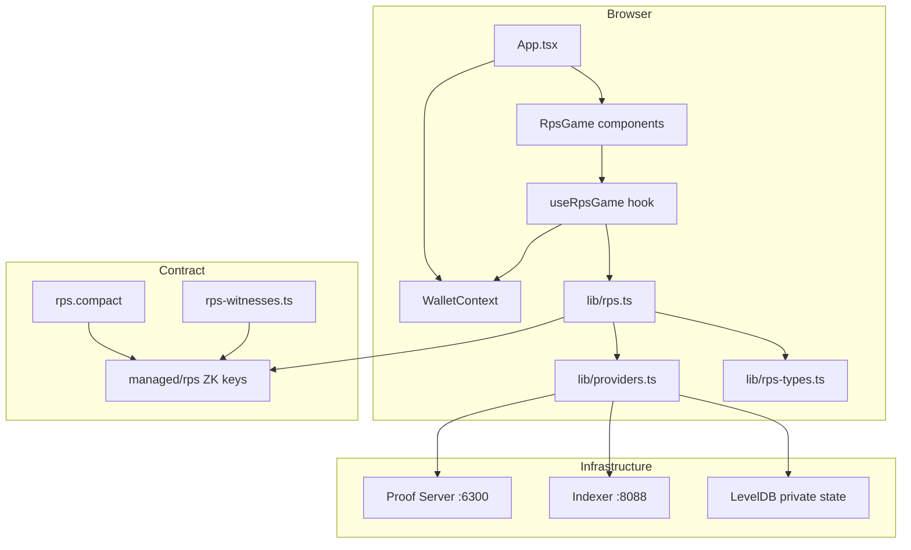
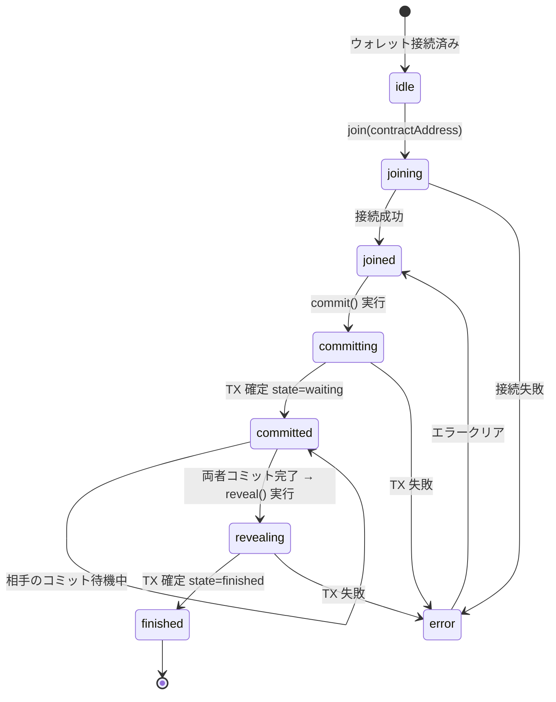
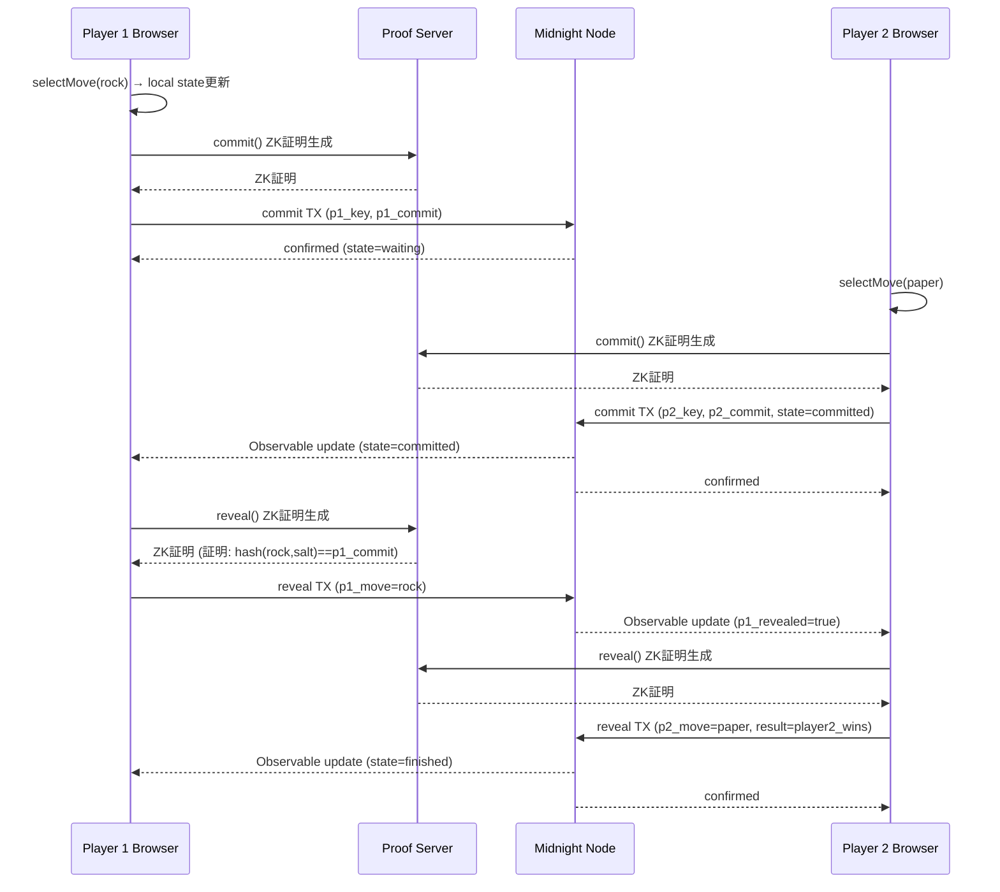

# テクニカルデザイン: midnight-rps-dapp

---

## 概要

Midnight ブロックチェーンのゼロ知識証明（ZK）機能を活用した 2 人対戦グー・チョキ・パー（RPS）dApp を、既存の Counter サンプルアプリケーションに追加実装する。本機能はコミット・リビール方式を採用し、ゲーム中は相手の手を数学的に秘匿したまま、ゲーム終了後に双方の手と勝敗を公開台帳で誰でも検証できる。

**対象ユーザー**: Midnight / ZK ブロックチェーンに興味を持つ開発者（RPS ゲームを通じて ZK dApp 開発パターンを学習）、および Lace Wallet ユーザー（ブラウザ経由でゲームをプレイ）。

**システムへの影響**: 既存の Counter コントラクト・UI・CLI に影響を与えず、新規ファイル追加と最小限の既存ファイル拡張でゼロから RPS 機能を構築する。

### Goals

- ZK コミット・リビールパターンを実装する `rps.compact` コントラクトの作成
- ブラウザ上でウォレット接続後すぐにプレイできる React UI の実装
- CLI から 2 プレイヤー間の統合テストを実行できる開発者向けツールの整備
- ZK 証明生成 < 10 秒、TX 確定 < 30 秒の性能要件を満たす

### Non-Goals

- tDUST トークンの賭け機能
- マルチゲーム・ロビー・ランキング機能
- モバイルアプリ対応
- Counter コントラクト・Counter UI の変更

---

## Boundary Commitments

### This Spec Owns

- `pkgs/contract/src/rps.compact` — RPS ゲームロジック（commit/reveal/result）
- `pkgs/contract/src/rps-witnesses.ts` — TypeScript witness 実装
- `pkgs/app/src/lib/rps.ts` + `rps-types.ts` — RPS コントラクト API 層
- `pkgs/app/src/hooks/useRpsGame.ts` — RPS ゲーム状態管理フック
- `pkgs/app/src/components/RpsGame/` — RPS UI コンポーネント群
- `pkgs/cli/src/` への RPS 関数追加（api.ts、cli.ts、common-types.ts）
- `pkgs/cli/src/test/rps.api.test.ts` — 統合テスト

### Out of Boundary

- `WalletContext` / `useWallet` — Lace Wallet 接続（既存実装に依存、変更しない）
- Counter コントラクト・Counter UI — 既存機能（変更しない）
- Docker インフラ（standalone.yml、proof-server.yml）— 既存構成を流用
- Midnight SDK プロバイダー実装（proof server、indexer への実際の接続）
- tDUST / NIGHT トークン操作

### Allowed Dependencies

- 既存 `WalletContext` が提供する `providers`（`WalletState.connected.providers`）
- `@midnight-ntwrk/compact-js` v2.5.0（`CompiledContract.make`）
- `@midnight-ntwrk/midnight-js-contracts` v4.0.4（`findDeployedContract`, `deployContract`）
- `@midnight-ntwrk/midnight-js-fetch-zk-config-provider` v4.0.4（ブラウザ ZK 設定取得）
- `@midnight-ntwrk/midnight-js-level-private-state-provider` v4.0.4（private state 永続化）
- `compactc` — `rps.compact` のコンパイルに必要（開発時ツール）
- 既存 `Sonner` トースト、`i18next`、`shadcn/ui` コンポーネント

### Revalidation Triggers

- `rps.compact` の台帳フィールドを追加・削除・型変更した場合
- `RpsPrivateState` の型定義を変更した場合
- `RpsProviders` の型定義が変わった場合（providers.ts の変更）
- ZK キーパス（`/managed/rps`）を変更した場合（app と CLI の zkConfigProvider に影響）

---

## Architecture

### Existing Architecture Analysis

既存の Counter アーキテクチャは RPS の雛形として機能する。以下のパターンを踏襲する：

- **コントラクト層**: Compact 言語で記述 → `compactc` で ZK キー + TS 型を生成
- **API 層** (`lib/counter.ts`): `CompiledContract.make` + `findDeployedContract` + RxJS Observable
- **型定義** (`lib/counter-types.ts`): `MidnightProviders<Circuits, StateId, PrivateState>` パターン
- **フック** (`hooks/useCounter.ts`): join → subscribe → action ステートマシン
- **プロバイダー** (`lib/providers.ts`): `FetchZkConfigProvider` + `httpClientProofProvider` の構成

RPS は Counter と全く異なる台帳・回路を持つため、Counter ファイルを拡張せず新規ファイルとして分離する。

### Architecture Pattern & Boundary Map



**選択パターン**: Counter と同一の Provider Chain パターン（Wallet Provider → Midnight Provider → ZK Config Provider → Proof Provider → Private State Provider → Public Data Provider）  
**新規コンポーネントの根拠**: Counter と RPS は全く異なる台帳・回路を持つ独立したコントラクトであり、混在は保守性を著しく損なう

### Technology Stack

| Layer | 技術 / バージョン | RPS での役割 | 備考 |
|-------|---------|--------|------|
| Contract | Compact `>= 0.16 && <= 0.21` | commit/reveal/結果判定回路 | `persistentHash` を使用 |
| ZK Runtime | `@midnight-ntwrk/compact-runtime` 0.15.0 | ブラウザ内 ZK 証明実行 | 既存依存を流用 |
| Contract SDK | `@midnight-ntwrk/compact-js` 2.5.0 | `CompiledContract.make` | 既存依存を流用 |
| Providers | `@midnight-ntwrk/midnight-js-*` 4.0.4 | ZK Config / Proof / Indexer / Private State | 既存依存を流用 |
| Frontend | React 19 + TypeScript 6 + Vite 5 | RPS UI コンポーネント | 既存スタックを流用 |
| State | RxJS 7 | 台帳のリアルタイム購読 | 既存パターンを流用 |
| Private Storage | LevelDB (`levelPrivateStateProvider`) | secretKey / myMove / mySalt の永続化 | nameSpace: `rpsPrivateState` |
| CLI | Node.js + Pino + testcontainers | RPS deploy/commit/reveal + 統合テスト | 既存 CLI に追加 |

---

## File Structure Plan

### Directory Structure

```
pkgs/
├── contract/src/
│   ├── rps.compact              # NEW: RPS Compact コントラクト
│   ├── rps-witnesses.ts         # NEW: TypeScript witness 実装
│   ├── index.ts                 # MODIFY: Rps エクスポートを追加
│   └── managed/
│       └── rps/                 # compactc 生成 (新規)
│           ├── contract/        # TS 型定義 (index.d.ts, index.js)
│           ├── keys/            # ZK 鍵ファイル (*.prover, *.verifier)
│           └── zkir/            # ZK 中間表現 (*.bzkir, *.zkir)
│
├── app/src/
│   ├── lib/
│   │   ├── rps.ts               # NEW: RPS コントラクト API
│   │   ├── rps-types.ts         # NEW: RPS 型定義
│   │   └── providers.ts         # MODIFY: createRpsProviders() 追加
│   ├── hooks/
│   │   └── useRpsGame.ts        # NEW: RPS ゲーム状態管理フック
│   ├── components/
│   │   └── RpsGame/
│   │       ├── index.tsx        # NEW: RPS ゲームルートコンポーネント
│   │       ├── MoveSelector.tsx # NEW: グー・チョキ・パー選択
│   │       ├── CommitButton.tsx # NEW: コミット送信ボタン
│   │       ├── RevealButton.tsx # NEW: リビール送信ボタン
│   │       ├── ResultDisplay.tsx# NEW: 結果表示
│   │       └── WaitingState.tsx # NEW: 相手待機表示
│   ├── i18n/locales/
│   │   ├── ja.ts                # MODIFY: rps.* キーを追加
│   │   └── en.ts                # MODIFY: rps.* キーを追加
│   ├── App.tsx                  # MODIFY: <RpsGame /> セクションを追加
│   └── public/managed/
│       └── rps/                 # NEW: ZK キー (sync-keys-rps でコピー)
│           ├── keys/
│           └── zkir/
│
└── cli/src/
    ├── api.ts                   # MODIFY: RPS deploy/join/commit/reveal 追加
    ├── common-types.ts          # MODIFY: RPS 型定義を追加
    ├── cli.ts                   # MODIFY: RPS メニュー追加
    └── test/
        └── rps.api.test.ts      # NEW: 2 プレイヤー統合テスト
```

### Modified Files

| ファイル | 変更内容 |
|---|---|
| `pkgs/contract/src/index.ts` | `export * as Rps from "./managed/rps/contract/index.js"` と RPS witness を追加 |
| `pkgs/app/src/lib/providers.ts` | `createRpsProviders()` 関数を追加（zkConfigPath のみ `/managed/rps` に変更） |
| `pkgs/app/src/App.tsx` | `<RpsGame />` セクションを `<CounterSection />` の下に追加 |
| `pkgs/app/src/i18n/locales/ja.ts` | `rps` キーグループを追加 |
| `pkgs/app/src/i18n/locales/en.ts` | `rps` キーグループを追加 |
| `pkgs/cli/src/api.ts` | `deployRps`, `joinRps`, `commitRps`, `revealRps`, `getRpsState` を追加 |
| `pkgs/cli/src/common-types.ts` | `RpsCircuits`, `RpsProviders`, `DeployedRpsContract` を追加 |
| `pkgs/cli/src/cli.ts` | RPS インタラクティブメニューを追加 |
| `package.json` (root) | `sync-keys-rps` スクリプトを追加 |

---

## System Flows

### ゲーム状態遷移



### コミット・リビール シーケンス



---

## Requirements Traceability

| 要件 | 概要 | コンポーネント | インターフェース | フロー |
|---|---|---|---|---|
| 1.1 | ZK 証明で手のコミットメント登録 | `rps.compact` commit() | `RpsContractAPI.commitMove()` | コミットシーケンス |
| 1.2 | P1 として台帳に記録 | `rps.compact` commit() ledger書き込み | — | コミットシーケンス |
| 1.3 | P2 コミット→state=committed | `rps.compact` commit() 条件分岐 | — | コミットシーケンス |
| 1.4 | 二重コミット拒否 | `rps.compact` assert(!p1_joined) | — | — |
| 1.5 | 非 waiting 状態でのコミット拒否 | `rps.compact` assert(state==waiting) | — | — |
| 1.6 | コミット段階でハッシュのみ公開 | Compact commitment スキーム | — | — |
| 2.1 | ZK 証明でリビール | `rps.compact` reveal() | `RpsContractAPI.revealMove()` | リビールシーケンス |
| 2.2–2.3 | P1/P2 の reveal 台帳記録 | `rps.compact` reveal() | — | — |
| 2.4 | コミット不一致時 TX 拒否 | `rps.compact` assert(computed==p1_commit) | — | — |
| 2.5 | 二重リビール拒否 | `rps.compact` assert(!p1_revealed) | — | — |
| 2.6 | 非 committed 状態でのリビール拒否 | `rps.compact` assert(state==committed) | — | — |
| 2.7 | 非プレイヤーによるリビール拒否 | `rps.compact` assert(is_p1 or is_p2) | — | — |
| 3.1 | 両者リビール後に勝敗確定 | `rps.compact` who_wins() + ledger書き込み | — | リビールシーケンス |
| 3.2 | 引き分け記録 | `rps.compact` who_wins() GameResult.draw | — | — |
| 3.3 | game_over=true / state=finished | `rps.compact` reveal() | — | 状態遷移図 |
| 3.4 | finished 後 commit/reveal 拒否 | `rps.compact` assert(!game_over) | — | — |
| 4.1 | ZK 証明でプレイヤー識別 | `rps.compact` derive_pk() | — | — |
| 4.2 | 後出し不正防止 | ZK 証明 make_commit 検証 | — | — |
| 4.3 | 32 バイト salt で hash 保護 | rps-witnesses.ts get_my_salt() | — | — |
| 4.4 | 秘密鍵・salt はネットワーク非公開 | witness (off-chain のみ) | — | — |
| 5.1–5.5 | 手選択・コミット UI | `MoveSelector`, `CommitButton`, `useRpsGame` | `UseRpsGameResult` | 状態遷移図 |
| 6.1–6.4 | 相手待機・状態表示 | `WaitingState`, `useRpsGame` RxJS購読 | `subscribeToRpsState()` | — |
| 7.1–7.4 | リビール UI | `RevealButton`, `useRpsGame` | `UseRpsGameResult` | — |
| 8.1–8.5 | ゲーム結果表示 | `ResultDisplay`, i18n | `RpsLedgerState` | — |
| 9.1–9.4 | CLI deploy/commit/reveal + 統合テスト | cli/src/api.ts + cli.ts + rps.api.test.ts | `RpsCliAPI` | — |
| 10.1 | ZK 証明 < 10 秒 | Proof Server インフラ | — | — |
| 10.2 | TX 確定 < 30 秒 | Docker 環境 | — | — |
| 10.3–10.6 | Chrome 120+、エラーハンドリング | `useRpsGame` エラー状態 + トースト | — | — |

---

## Components and Interfaces

### サマリーテーブル

| コンポーネント | 層 | 責務 | 要件 | 主要依存 | 契約 |
|---|---|---|---|---|---|
| `rps.compact` | Contract | ZK 回路定義・台帳管理 | 1–4 | CompactStandardLibrary | State |
| `rps-witnesses.ts` | Contract | TypeScript witness 実装 | 4.3, 4.4 | `rps.compact` 型 | State |
| `rps.ts` | API | コントラクト接続・操作 | 1–4, 9 | compact-js, midnight-js | Service |
| `rps-types.ts` | API | 型定義 | 全体 | compact-js, midnight-js | — |
| `providers.ts` (拡張) | API | RPS プロバイダー生成 | 全体 | WalletContext | Service |
| `useRpsGame` | Hook | ゲーム状態管理 | 5–8 | rps.ts, WalletContext | State |
| `RpsGame/index.tsx` | UI | RPS UI ルート | 5–8 | useRpsGame | — |
| `MoveSelector` | UI | 手選択 | 5.1, 5.2 | useRpsGame | — |
| `CommitButton` | UI | コミット送信 | 5.3–5.5 | useRpsGame | — |
| `RevealButton` | UI | リビール送信 | 7.1–7.4 | useRpsGame | — |
| `ResultDisplay` | UI | 結果表示 | 8.1–8.5 | useRpsGame | — |
| `WaitingState` | UI | 待機状態表示 | 6.1–6.4 | useRpsGame | — |
| CLI RPS API | CLI | deploy/commit/reveal | 9 | rps.compact 型 | Service |

---

### Contract Layer

#### rps.compact

| Field | Detail |
|-------|--------|
| Intent | コミット・リビール・勝敗判定ロジックを持つ RPS ゲームコントラクト |
| Requirements | 1.1–1.6, 2.1–2.7, 3.1–3.4, 4.1–4.4 |

**Compact ソースコード設計**

```compact
pragma language_version >= 0.16 && <= 0.21;

import CompactStandardLibrary;

// ─── 型定義 ────────────────────────────────────────────────────────────────
export enum GameState   { waiting, committed, finished }
export enum Move        { rock, paper, scissors }
export enum GameResult  { not_determined, player1_wins, player2_wins, draw }

// ─── 公開台帳 ─────────────────────────────────────────────────────────────
export ledger state:       GameState;
export ledger game_over:   Boolean;
export ledger p1_key:      Bytes<32>;
export ledger p2_key:      Bytes<32>;
export ledger p1_joined:   Boolean;
export ledger p2_joined:   Boolean;
export ledger p1_commit:   Bytes<32>;
export ledger p2_commit:   Bytes<32>;
export ledger p1_revealed: Boolean;
export ledger p2_revealed: Boolean;
export ledger p1_move:     Move;
export ledger p2_move:     Move;
export ledger result:      GameResult;

// ─── Witness (オフチェーン / プライベート) ────────────────────────────────
witness local_secret_key():                  Bytes<32>;
witness get_my_move():                       Move;
witness get_my_salt():                       Bytes<32>;
witness store_move_and_salt(m: Move, s: Bytes<32>): [];

// ─── Pure Circuit: ヘルパー関数 ───────────────────────────────────────────
pure circuit derive_pk(sk: Bytes<32>): Bytes<32> {
  return persistentHash<Vector<2, Bytes<32>>>([pad(32, "rps:pk:v1"), sk]);
}

pure circuit make_commit(m: Move, salt: Bytes<32>): Bytes<32> {
  const move_bytes = (m as Field) as Bytes<32>;
  const move_hash  = persistentHash<Vector<1, Bytes<32>>>([move_bytes]);
  return persistentHash<Vector<2, Bytes<32>>>([move_hash, salt]);
}

pure circuit who_wins(m1: Move, m2: Move): GameResult {
  if (m1 == m2) { return GameResult.draw; }
  if (m1 == Move.rock     && m2 == Move.scissors) { return GameResult.player1_wins; }
  if (m1 == Move.scissors && m2 == Move.paper)    { return GameResult.player1_wins; }
  if (m1 == Move.paper    && m2 == Move.rock)     { return GameResult.player1_wins; }
  return GameResult.player2_wins;
}

// ─── Export Circuit: commit ───────────────────────────────────────────────
export circuit commit(): [] {
  assert(!game_over,               "Game is already over");
  assert(state == GameState.waiting, "Not in waiting state");

  const sk         = local_secret_key();
  const pk         = derive_pk(sk);
  const my_move    = get_my_move();
  const my_salt    = get_my_salt();
  const commitment = make_commit(my_move, my_salt);
  store_move_and_salt(my_move, my_salt);

  if (!p1_joined) {
    p1_key    = disclose(pk);
    p1_commit = disclose(commitment);
    p1_joined = true;
  } else {
    assert(!p2_joined, "Both players already committed");
    p2_key    = disclose(pk);
    p2_commit = disclose(commitment);
    p2_joined = true;
    state     = GameState.committed;
  }
}

// ─── Export Circuit: reveal ───────────────────────────────────────────────
export circuit reveal(): [] {
  assert(!game_over,                 "Game is already over");
  assert(state == GameState.committed, "Not in committed state");

  const sk       = local_secret_key();
  const pk       = derive_pk(sk);
  const my_move  = get_my_move();
  const my_salt  = get_my_salt();
  const computed = make_commit(my_move, my_salt);

  const is_p1 = disclose(p1_key == pk);
  const is_p2 = disclose(p2_key == pk);
  assert(is_p1 || is_p2, "Caller is not a registered player");

  if (is_p1) {
    assert(!p1_revealed, "Player 1 already revealed");
    assert(disclose(computed == p1_commit), "Commitment mismatch for P1");
    p1_move     = disclose(my_move);
    p1_revealed = true;
  }
  if (is_p2) {
    assert(!p2_revealed, "Player 2 already revealed");
    assert(disclose(computed == p2_commit), "Commitment mismatch for P2");
    p2_move     = disclose(my_move);
    p2_revealed = true;
  }

  if (disclose(p1_revealed && p2_revealed)) {
    result    = who_wins(p1_move, p2_move);
    game_over = true;
    state     = GameState.finished;
  }
}
```

**key design decisions**:
- `persistentHash` を使ったコミットメントスキーム: `C = H(H(move_bytes), salt)` — hiding（salt があるため逆算不可）+ binding（ZK 証明で一致検証）
- `derive_pk` のドメイン分離 `"rps:pk:v1"` — Counter や他のコントラクトとの PK 衝突を防止
- `disclose()` の適用: witness 値をコンディショナルや台帳書き込みに使う前に必ず適用
- `is_p1 || is_p2` の両方を `if` で処理: 排他的ではなく各プレイヤーが自身の分だけ書き込む

**Implementation Notes**:
- Compact で `&&` を複数の `if` に展開（`disclose(p1_revealed && p2_revealed)` は両者が boolean ledger フィールドに依存するため disclose が必要）
- `enum` から `Field` への cast: `(m as Field) as Bytes<32>` の 2 段 cast を使用
- `pure circuit` では ledger 読み取りは可能だが書き込みは不可

---

#### rps-witnesses.ts

| Field | Detail |
|-------|--------|
| Intent | `rps.compact` の witness を TypeScript で実装し、private state（secretKey / myMove / mySalt）を管理する |
| Requirements | 4.3, 4.4 |

**Contracts**: State [x]

##### State Management

- **State model**: `RpsPrivateState`（`secretKey` / `myMove` / `mySalt`）
- **Persistence**: `levelPrivateStateProvider` が LevelDB に暗号化保存
- **Concurrency**: 1 ユーザー 1 インスタンス想定、concurrent access なし

```typescript
// pkgs/contract/src/rps-witnesses.ts
import type { WitnessContext } from "@midnight-ntwrk/compact-js";

export const RpsPrivateStateId = "rpsPrivateState" as const;

export type RpsPrivateState = {
  readonly secretKey: Uint8Array;      // 32 バイト固定。初期化時に生成、以降変更なし
  readonly myMove: number | null;      // 0=rock, 1=paper, 2=scissors
  readonly mySalt: Uint8Array | null;  // 32 バイトランダム塩
};

export const INITIAL_RPS_PRIVATE_STATE: RpsPrivateState = {
  secretKey: crypto.getRandomValues(new Uint8Array(32)),
  myMove: null,
  mySalt: null,
};

type RpsWitnessContext = WitnessContext<typeof RpsPrivateStateId, RpsPrivateState>;

export const rpsWitnesses = {
  local_secret_key: (ctx: RpsWitnessContext): Uint8Array => {
    return ctx.privateState.secretKey;
  },
  get_my_move: (ctx: RpsWitnessContext): number => {
    const { myMove } = ctx.privateState;
    if (myMove === null) throw new Error("Move not set: call setMyMove() before commit()");
    return myMove;
  },
  get_my_salt: (ctx: RpsWitnessContext): Uint8Array => {
    const { mySalt } = ctx.privateState;
    if (mySalt === null) throw new Error("Salt not set: call setMyMove() before commit()");
    return mySalt;
  },
  store_move_and_salt: (
    ctx: RpsWitnessContext,
    m: number,
    s: Uint8Array,
  ): void => {
    ctx.setPrivateState({ ...ctx.privateState, myMove: m, mySalt: s });
  },
};
```

**Implementation Notes**:
- `secretKey` は `INITIAL_RPS_PRIVATE_STATE` 生成時に 1 回だけランダム生成。`levelPrivateStateProvider` が LevelDB に保存するため、同ブラウザ / 同アカウントでは同一 PK が維持される
- `setMyMove(move)` は `useRpsGame` フックが commit() 呼び出し前に private state を更新する（circuit 外で呼び出す）
- `WitnessContext` 型の exact shape は compact-js v2.5.0 の型定義に従う（実装時に確認必須）

---

### API Layer (pkgs/app/src/lib)

#### rps-types.ts

```typescript
import type { CompiledContract } from "@midnight-ntwrk/compact-js";
import type {
  DeployedContract,
  FoundContract,
} from "@midnight-ntwrk/midnight-js-contracts";
import type {
  AnyProvableCircuitId,
  MidnightProviders,
} from "@midnight-ntwrk/midnight-js-types";
import type { RpsPrivateState } from "contract";

export type RpsCircuits = AnyProvableCircuitId;
export { RpsPrivateStateId } from "contract";

export type RpsProviders = MidnightProviders<
  RpsCircuits,
  typeof import("contract").RpsPrivateStateId,
  RpsPrivateState
>;

export type RpsContractInstance = CompiledContract.CompiledContract<
  RpsCircuits,
  RpsPrivateState
>;

export type DeployedRpsContract = DeployedContract<RpsCircuits> | FoundContract<RpsCircuits>;

export const enum RpsMove {
  rock = 0,
  paper = 1,
  scissors = 2,
}

export const enum RpsGameState {
  waiting = 0,
  committed = 1,
  finished = 2,
}

export const enum RpsGameResult {
  not_determined = 0,
  player1_wins = 1,
  player2_wins = 2,
  draw = 3,
}

export type RpsLedgerState = {
  state: RpsGameState;
  game_over: boolean;
  p1_key: Uint8Array;
  p2_key: Uint8Array;
  p1_joined: boolean;
  p2_joined: boolean;
  p1_commit: Uint8Array;
  p2_commit: Uint8Array;
  p1_revealed: boolean;
  p2_revealed: boolean;
  p1_move: RpsMove;
  p2_move: RpsMove;
  result: RpsGameResult;
};
```

---

#### rps.ts

| Field | Detail |
|-------|--------|
| Intent | RPS コントラクトの join・deploy・commit・reveal・状態購読 API |
| Requirements | 1.1–4.4, 9 |

**Contracts**: Service [x]

##### Service Interface

```typescript
// pkgs/app/src/lib/rps.ts

/** deploy 済みコントラクトに接続する */
export function joinRpsContract(
  providers: RpsProviders,
  contractAddress: string,
): Promise<DeployedRpsContract>;

/** 新しい RPS コントラクトをデプロイする */
export function deployRpsContract(
  providers: RpsProviders,
): Promise<DeployedRpsContract>;

/**
 * commit() 回路を呼び出す前に private state に手と salt を設定する。
 * commit() circuit の get_my_move() / get_my_salt() witness が参照する。
 */
export function setMyMove(
  providers: RpsProviders,
  move: RpsMove,
): Promise<void>;

/** commit() 回路を呼び出す */
export function commitMove(
  contract: DeployedRpsContract,
): Promise<void>;

/** reveal() 回路を呼び出す */
export function revealMove(
  contract: DeployedRpsContract,
): Promise<void>;

/** 現在の台帳状態を1回取得 */
export function getRpsLedgerState(
  providers: RpsProviders,
  contractAddress: ContractAddress,
): Promise<RpsLedgerState | null>;

/** 台帳状態変化の Observable */
export function subscribeToRpsState(
  providers: RpsProviders,
  contractAddress: ContractAddress,
): Observable<RpsLedgerState>;
```

- **Preconditions**: `setMyMove` は `commitMove` より前に呼び出すこと
- **Postconditions**: `commitMove` 成功後、`subscribeToRpsState` が新しい台帳状態を emit する
- **Invariants**: `DeployedRpsContract` は `joinRpsContract` または `deployRpsContract` の戻り値のみを使用すること

**Implementation Notes**:
- `rpsContractInstance` は `CompiledContract.make("rps", Rps.Contract).pipe(CompiledContract.withVacantWitnesses)` で生成。`withVacantWitnesses` は witnesses が TypeScript 側で実装されるため使用
- `subscribeToRpsState` は `contractStateObservable(addr, {type:"latest"})` の RxJS `map` で `Rps.ledger(state.data)` を変換する

---

#### providers.ts (拡張)

追加する関数:

```typescript
export function createRpsProviders(
  connection: WalletConnectionResult,
): RpsProviders {
  // createCounterProviders と同一ロジック。変更点:
  // zkConfigProvider のパスを `/managed/rps` に変更
  // privateStateProvider の namespace を RpsPrivateStateId に変更
}
```

---

### Hook Layer

#### useRpsGame

| Field | Detail |
|-------|--------|
| Intent | RPS ゲームの全状態（join / selectMove / commit / reveal / result）を管理するカスタムフック |
| Requirements | 5.1–8.5, 10.3–10.6 |

**Contracts**: State [x]

##### State Management

```typescript
// pkgs/app/src/hooks/useRpsGame.ts

export type RpsStatus =
  | "idle"
  | "joining"
  | "joined"
  | "committing"
  | "committed"   // 自分はコミット済み、相手待機中
  | "revealing"
  | "finished"
  | "error";

export type UseRpsGameResult = {
  contractAddress: string;
  ledgerState: RpsLedgerState | null;
  selectedMove: RpsMove | null;
  status: RpsStatus;
  error: string | null;
  coinPublicKey: string;              // 自分が P1/P2 判定に使用
  setContractAddress: (addr: string) => void;
  join: (addr: string) => Promise<void>;
  selectMove: (move: RpsMove) => void;  // commit 前のローカル選択
  commit: () => Promise<void>;
  reveal: () => Promise<void>;
};
```

**状態遷移ルール**:
- `idle` → `joining` → `joined`: `join()` 成功後、`subscribeToRpsState` 開始
- `joined` + `selectedMove !== null` → `committing` → `committed`: `commit()` 実行
- `committed` + `ledgerState.state === committed` → `revealing` → `finished`: `reveal()` 実行
- 台帳購読から `ledgerState.state === finished` を検知 → status を `finished` に自動遷移
- 任意のフェーズでエラー → `error` 状態。次のアクション試行で `error` → 前の状態に戻る

**Implementation Notes**:
- `subscribeToRpsState` の購読は `joined` 状態維持中は継続。ウォレット切断 or コンポーネントアンマウント時に `unsubscribe()`
- `selectMove` はローカル state のみ更新（no async）。実際の private state 更新は `commit()` 内で `setMyMove()` を呼び出す
- `coinPublicKey` は `useWallet().state.connected.connection.state.coinPublicKey` から取得。UI 側での P1/P2 判定に使用

---

### UI Layer (pkgs/app/src/components/RpsGame)

全 UI コンポーネントは `useRpsGame()` から props 的に必要な値を受け取る。

#### RpsGame/index.tsx

メインコンポーネント。`contractAddress` 入力と Join 操作を担当し、`status` に応じて子コンポーネントを切り替える。

```
status=idle|joining    → contractAddress 入力 + Join ボタン
status=joined          → MoveSelector + CommitButton
status=committing      → MoveSelector (無効) + CommitButton (ローディング)
status=committed       → WaitingState（相手のコミット待機 or 両者完了 + RevealButton）
status=revealing       → RevealButton (ローディング)
status=finished        → ResultDisplay
status=error           → エラーバナー + リトライ
```

#### MoveSelector

グー（🪨）・チョキ（✌️）・パー（🖐）の 3 ボタン。選択中はハイライト表示。`status=committing` 中は無効化。

**Props**: `selectedMove: RpsMove | null`, `onSelect: (move: RpsMove) => void`, `disabled: boolean`

#### CommitButton

選択した手でコミットを送信するボタン。ZK 証明生成中は `Loader2` アイコン + "処理中..." テキストを表示。

**Props**: `onCommit: () => void`, `disabled: boolean`, `isLoading: boolean`

#### RevealButton

リビール操作を送信するボタン。コンポーネントは `status=committed && ledgerState.state===committed` のときのみ表示。

**Props**: `onReveal: () => void`, `disabled: boolean`, `isLoading: boolean`

#### WaitingState

ゲーム状態に応じて待機メッセージを切り替える表示コンポーネント。

- `p1_joined=true, p2_joined=false` → 「相手のコミット待機中...」
- `state=committed, !myRevealed` → 「リビールボタンが表示されます」
- `state=committed, myRevealed` → 「相手のリビール待機中...」

**Props**: `ledgerState: RpsLedgerState`, `coinPublicKey: string`

#### ResultDisplay

両者の手と最終結果を表示。勝利・敗北・引き分けに応じたメッセージを i18n で多言語化。

**Props**: `ledgerState: RpsLedgerState`, `coinPublicKey: string`

---

### CLI Layer (pkgs/cli/src)

#### api.ts への追加（RPS API）

```typescript
// 追加する関数シグネチャ

export function deployRps(
  providers: RpsProviders,
  initialPrivateState: RpsPrivateState,
): Promise<DeployedRpsContract>;

export function joinRps(
  providers: RpsProviders,
  contractAddress: string,
): Promise<DeployedRpsContract>;

export function commitRps(
  contract: DeployedRpsContract,
  move: RpsMove,
): Promise<FinalizedTxData>;

export function revealRps(
  contract: DeployedRpsContract,
): Promise<FinalizedTxData>;

export function getRpsState(
  providers: RpsProviders,
  contractAddress: ContractAddress,
): Promise<RpsLedgerState | null>;
```

**Implementation Notes**:
- `commitRps` では circuit 呼び出し前に `setMyMove()` で private state を更新
- 2 プレイヤーが同一プロセスで動作する統合テストのために、各プレイヤー専用の `providers` を別々に構成する（別 `accountId` = 別 LevelDB namespace）

---

## Data Models

### Domain Model

```
RpsGame (Aggregate Root)
├── GameState: waiting | committed | finished
├── Player (Value Object): { key: Bytes<32>, commit: Bytes<32>, move: Move, joined: boolean, revealed: boolean }
│   ├── Player1
│   └── Player2
├── GameResult: not_determined | player1_wins | player2_wins | draw
└── game_over: Boolean

Commitment (Value Object)
├── hash: persistentHash(persistentHash(move_bytes), salt)  ← on-chain
├── move: Move  ← off-chain (witness)
└── salt: Bytes<32>  ← off-chain (witness)
```

### Logical Data Model

**オンチェーン（公開台帳）**: 13 フィールド、全て `export ledger`。`ContractAddress` をキーとして Indexer が提供する `contractStateObservable` で購読可能。

**オフチェーン（private state）**: `RpsPrivateState` → `levelPrivateStateProvider` が `{accountId, "rpsPrivateState"}` をキーに LevelDB に暗号化保存。

**ローカル（React state）**: `selectedMove`（commit 前の一時的な選択）は React state のみ。`contractAddress` は `localStorage` にキャッシュ（Counter と同様）。

---

## Error Handling

### Error Strategy

全エラーは `useRpsGame` が捕捉し `error` 文字列として管理。UI は Sonner トースト + インラインエラーパネルで表示。

### Error Categories and Responses

| カテゴリ | 原因 | 対応 |
|---|---|---|
| Wallet エラー | Lace 未接続 | WalletContext が処理（このスペックのスコープ外） |
| Contract エラー | アドレス不正、コントラクト未デプロイ | `join()` で catch → `error` 状態 + トースト |
| ZK 証明エラー | Proof Server 接続失敗、回路アサーション失敗 | `commit()` / `reveal()` で catch → トースト + リトライ案内 |
| TX エラー | ガス不足（DUST）、ネットワーク切断 | catch → エラーメッセージ + リトライ案内 |
| Witness エラー | `myMove/mySalt` が null（不正な操作順） | throw → アプリ設計エラーとして即座に throw |
| 状態遷移違反 | 既にコミット済みで再コミット試行 | コントラクトの assert が ZK 証明失敗として throw |

**ZK 証明失敗の特殊ケース**: "Commitment mismatch" / "Not a valid player" は後出し不正またはプログラムバグを示す。エラーメッセージをそのままトーストに表示する。

---

## Testing Strategy

### Contract Tests (pkgs/contract/src/test)

- **rps-simulator.ts**: commit/reveal のシミュレーター実装（counter-simulator.ts を雛形に作成）
- `who_wins()` pure circuit のすべての 9 通りの組み合わせをシミュレーターでテスト（Req 3.1, 3.2）
- `make_commit()` の hiding / binding 特性をシミュレーターで確認（同じ move + salt → 同じ hash）
- 二重コミット（Req 1.4）・二重リビール（Req 2.5）の assert が発火することをシミュレーターで確認

### Integration Tests (pkgs/cli/src/test/rps.api.test.ts)

- 2 プレイヤー（2 つの wallet context、別 accountId）による完全ゲームフロー（Req 1–3, 9）
- P1: `rock`, P2: `paper` → `result = player2_wins` の検証（Req 3.1）
- 引き分け検証: `rock` vs `rock` → `result = draw`（Req 3.2）
- 不正操作: P1 が commit 後に reveal 前に再 commit 試行 → TX 拒否（Req 1.4）
- 2 プレイヤーの wallet は Genesis seed（standalone） + 別途生成した seed で構成

### Unit Tests (pkgs/app)

- `useRpsGame` の状態遷移を `renderHook` でテスト（idle→joining→joined→committing→...）
- `createRpsProviders` が Counter 版と異なる zkConfigPath を返すことを確認

### E2E / Manual Tests

- Chrome + Lace Wallet 環境で 2 ブラウザウィンドウを使い、完全なゲームフローをプレイ（Req 5–8, 10）
- ZK 証明生成時間 < 10 秒を手動計測（Req 10.1）
- Proof Server 停止時のエラートースト表示確認（Req 10.5）

---

## Security Considerations

ZK 証明のセキュリティは Compact コントラクトが担保する。TypeScript 実装側で追加考慮すべき点:

- **secretKey 漏洩防止**: `RpsPrivateState.secretKey` は `levelPrivateStateProvider` の暗号化 LevelDB にのみ保存。メモリ上での不要なコピーを最小化する
- **salt 予測可能性**: `get_my_salt()` は `crypto.getRandomValues(new Uint8Array(32))` を使用。Math.random() は使用禁止
- **commit→reveal 間のデータ整合性**: private state の `myMove / mySalt` は commit() 成功後に確定。reveal() は private state から取得するため、ブラウザリロード後も LevelDB から復元できる

---

## Performance & Scalability

| 指標 | 目標 | 計測方法 |
|---|---|---|
| ZK 証明生成（commit） | < 10 秒 | ローカル Proof Server（`midnightntwrk/proof-server:8.0.3`）で手動計測 |
| ZK 証明生成（reveal） | < 10 秒 | 同上 |
| TX 確定（ローカル Docker） | < 30 秒 | testcontainers 統合テストのタイムアウトで検証 |
| 初期バンドルサイズ | 既存の Counter と変化なし | Vite ビルドログで確認 |

**ZK 証明時間のリスク**: commit/reveal 回路は Counter の increment より演算が多い（hash 計算 × 複数回）。実測で 10 秒を超える場合は Proof Server の並列化オプションを検討。

---

## Supporting References

### Compact 言語キーポイント（デザイン決定の根拠）

| 項目 | 正しいパターン | 誤ったパターン |
|---|---|---|
| 公開鍵導出 | `persistentHash<Vector<2, Bytes<32>>>([pad(32,"rps:pk:v1"), sk])` | `public_key(sk)` — 存在しない |
| コミットメント | `persistentHash<Vector<2, Bytes<32>>>([move_hash, salt])` | `persistentCommit(move)` — opaque で検証不可 |
| 条件分岐（witness 依存） | `if (disclose(is_p1))` | `if (is_p1)` — implicit disclosure error |
| 純粋関数 | `pure circuit helper(): T` | `pure function helper(): T` — 構文エラー |
| enum アクセス | `Move.rock` | `Move::rock` — Rust スタイル構文エラー |
| Uint→Bytes キャスト | `(m as Field) as Bytes<32>` | `m as Bytes<32>` — 直接キャスト不可 |
| pragma | `>= 0.16 && <= 0.21` | `>= 0.20` — パッチバージョン不要 |
