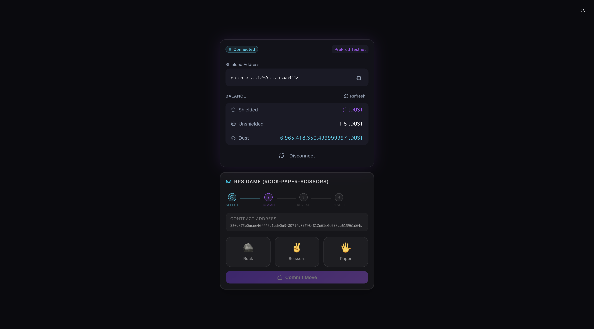
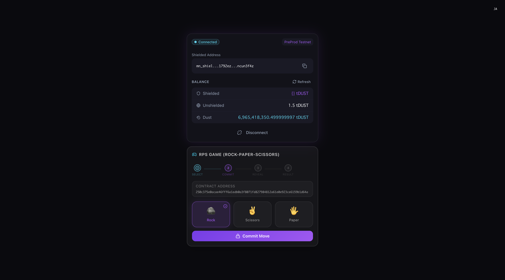
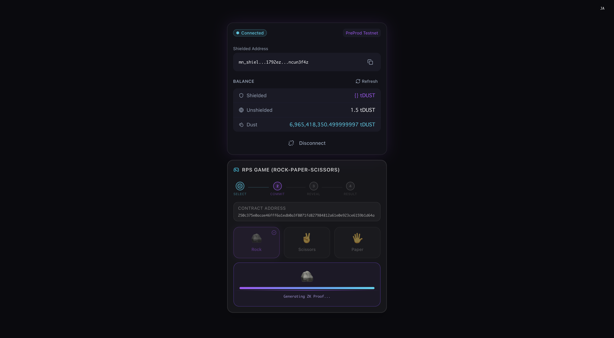
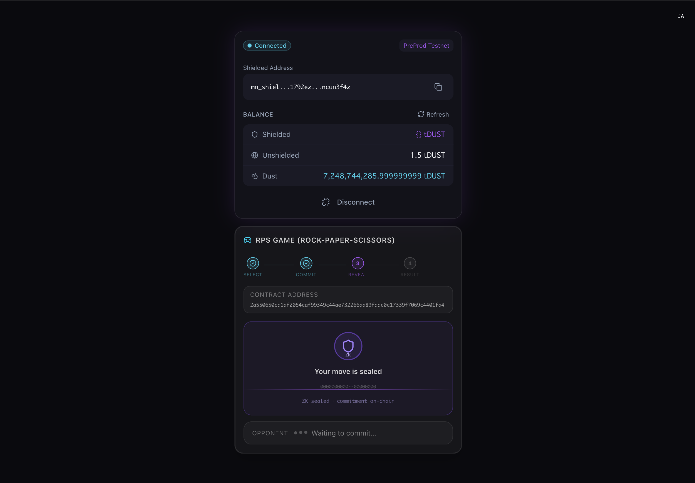
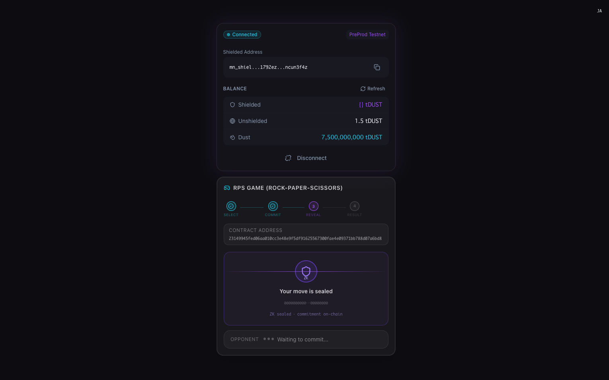
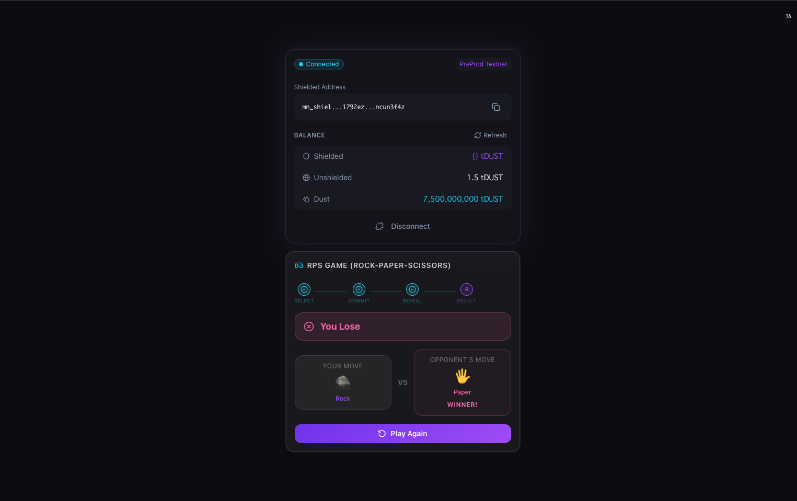

# midnight-rps-sample-app

Midnight RPS sample dApp

## Overview

midnight-rps-sample-app is a sample Rock-Paper-Scissors dApp project built on Midnight, a privacy-focused blockchain.

### Key Features

- **Fair Gameplay via Zero-Knowledge Proofs (ZK Proofs)**  
  The app utilizes a "commit/reveal" scheme powered by Compact smart contracts. Players commit to their move (Rock, Paper, or Scissors) by submitting a hashed value. Once all players have committed, the moves are revealed. This ensures a tamper-proof gaming experience where "sniping" or reacting to an opponent's move is impossible.

- **Powered by the Midnight Blockchain**  
  Contracts are deployed on the Midnight PreProd testnet, with all transactions recorded on-chain.

- **Full-Stack Architecture**  
  | Package | Role |
  |---|---|
  | `pkgs/contract` | Smart contracts written in the Compact language |
  | `pkgs/cli` | CLI tools for contract deployment and interaction |
  | `pkgs/app` | Frontend UI built with React + Vite |

- **Lace Wallet Integration**  
  Connects with Lace Wallet via the `@midnight-ntwrk/dapp-connector-api` for secure signing and transaction processing.

### Game Flow

1. **Commit Phase** — Each player commits their move and a salt to the blockchain as a hash (generating a ZK Proof).
2. **Reveal Phase** — Both players reveal their previously committed moves.
3. **Settlement** — The contract determines the outcome（`player1_wins` / `player2_wins` / `draw`）and records it on-chain.

## Environment Info

```bash
Docker version 27.4.0
compact 0.2.0        # wrapper CLI (manages compactc versions)
compactc 0.30.0      # actual Compact compiler — MUST use this version
bun 1.3.13
node 23.3.0
```

> **Important**: `compact 0.2.0` is the CLI wrapper only. The contract was authored and verified against **compactc 0.30.0** (language version 0.22). Installing a newer compactc (e.g. 0.31.0, which emits language 0.23) will fail the pragma check.
>
> After installing the `compact` wrapper CLI, pin the correct compactc version:
>
> ```bash
> compact update 0.30.0
> ```
>
> Verify with:
>
> ```bash
> compact list   # → should show 0.30.0 as active (marked with →)
> ```

## Application Image













## How to work

### Use Devcontainer (Recommended)

This repository includes a preconfigured Devcontainer environment.

1. Install the VS Code extension `Dev Containers` (`ms-vscode-remote.remote-containers`).
2. Open this repository in VS Code.
3. Run `Dev Containers: Reopen in Container` from the Command Palette.
4. Wait until container startup completes.

When the container is created, `compactc 0.30.0` is pinned automatically by `postCreateCommand`.

### Install Lace Wallet to your browser

If you have not yet installed Lace Wallet, you must go to below page & need to install Lace Wallet

https://www.lace.io/

Next, you need to create wallet account of Midnight

> Please switch to PreProd Network

### Install

```bash
bun install
```

### Build

First, compile the Compact contract:

```bash
bun contract compact
```

Then build all TypeScript packages (contract → sync keys → CLI → app):

```bash
bun run build
```

The `bun run build` command runs the full pipeline in order:
1. `pkgs/contract` — TypeScript compile + copy `managed/` into `dist/`
2. Sync ZK keys/circuits from contract into `pkgs/app/public/`
3. `pkgs/cli` — TypeScript compile
4. `pkgs/app` — Vite build

### Start Proof Server

> you must set version 8.0.3

```bash
docker run -d -p 127.0.0.1:6300:6300 midnightntwrk/proof-server:8.0.3 midnight-proof-server           
```

### Deploy Contract to PreProd Network

If you don't have testnet NIGHT Token, you can get some token from below site.

https://faucet.preprod.midnight.network/

```bash
bun cli preprod-ps
```

Deployed Contract Address info

```bash
[19:24:25.997] INFO (40223): Deploying RPS contract...
  ⠇ Deploying RPS contract[19:24:51.416] INFO (40223): Deployed RPS contract at: 23149945fed06aa010cc3e48e9f5df91625567300fae4e09371bb788d07a6bd8
  ✓ Deploying RPS contract
  Contract deployed at: 23149945fed06aa010cc3e48e9f5df91625567300fae4e09371bb788d07a6bd8
```

```bash
──────────────────────────────────────────────────────────────
  RPS Actions                         DUST: 3,497,759,478,999,999,996
  Contract: 23149945fed06aa010cc3e48e9f5df91625567300fae4e09371bb788d07a6bd8
──────────────────────────────────────────────────────────────
  [1] Commit my move
  [2] Reveal my move
  [3] Show game state
  [4] Exit
──────────────────────────────────────────────────────────────
> 1

──────────────────────────────────────────────────────────────
  Select your move
──────────────────────────────────────────────────────────────
  [1] Rock     🪨
  [2] Paper    🖐
  [3] Scissors ✌️
──────────────────────────────────────────────────────────────
> 1
[19:36:19.509] INFO (40223): Committing move 0...
  ⠸ Committing move (Rock) — generating ZK proof[19:36:45.473] INFO (40223): Commit TX 0072b7ad5d6127b3e6d02373ccd967c7329b2ca7a8be35d099f44ebb6736728cca added in block 618227
  ✓ Committing move (Rock) — generating ZK proof

──────────────────────────────────────────────────────────────
  RPS Actions                         DUST: 3,503,362,116,999,999,995
  Contract: 23149945fed06aa010cc3e48e9f5df91625567300fae4e09371bb788d07a6bd8
──────────────────────────────────────────────────────────────
  [1] Commit my move
  [2] Reveal my move
  [3] Show game state
  [4] Exit
──────────────────────────────────────────────────────────────
> 2
[19:37:05.494] INFO (40223): Revealing move...
  ⠇ Revealing move — generating ZK proof[19:37:33.105] INFO (40223): Reveal TX 00ba3dd2c40736337619c979afeb2210d8b36fc917a93e403a90b1378f07eb680e added in block 618235
  ✓ Revealing move — generating ZK proof

──────────────────────────────────────────────────────────────
  RPS Actions                         DUST: 3,503,458,932,999,999,994
  Contract: 23149945fed06aa010cc3e48e9f5df91625567300fae4e09371bb788d07a6bd8
──────────────────────────────────────────────────────────────

──────────────────────────────────────────────────────────────
  RPS Actions                         DUST: 3,504,021,088,999,999,994
  Contract: 23149945fed06aa010cc3e48e9f5df91625567300fae4e09371bb788d07a6bd8
──────────────────────────────────────────────────────────────
  [1] Commit my move
  [2] Reveal my move
  [3] Show game state
  [4] Exit
──────────────────────────────────────────────────────────────
> 3
[19:38:49.770] INFO (40223): Checking RPS ledger state...
[19:38:50.631] INFO (40223): RPS state: {"state":2,"game_over":true,"p1_key":"0xc3625c1f...","p2_key":"0x12c4698e...","p1_joined":true,"p2_joined":true,"p1_commit":"0x9accc673...","p2_commit":"0x7516506b...","p1_revealed":true,"p2_revealed":true,"p1_move":1,"p2_move":0,"result":1}

  Game State:   finished
  Game Over:    true
  P1 Joined:   true
  P2 Joined:   true
  P1 Revealed: true
  P2 Revealed: true
  Result:       player1_wins


──────────────────────────────────────────────────────────────
  RPS Actions                         DUST: 3,504,095,491,999,999,994
  Contract: 23149945fed06aa010cc3e48e9f5df91625567300fae4e09371bb788d07a6bd8
──────────────────────────────────────────────────────────────
  [1] Commit my move
  [2] Reveal my move
  [3] Show game state
  [4] Exit
──────────────────────────────────────────────────────────────
```

### Start server

```bash
bun app dev
```