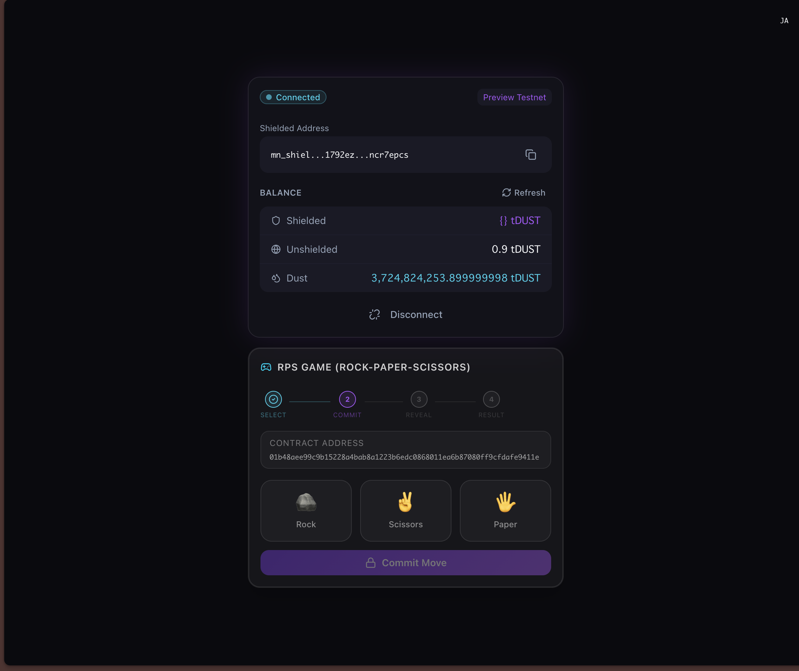
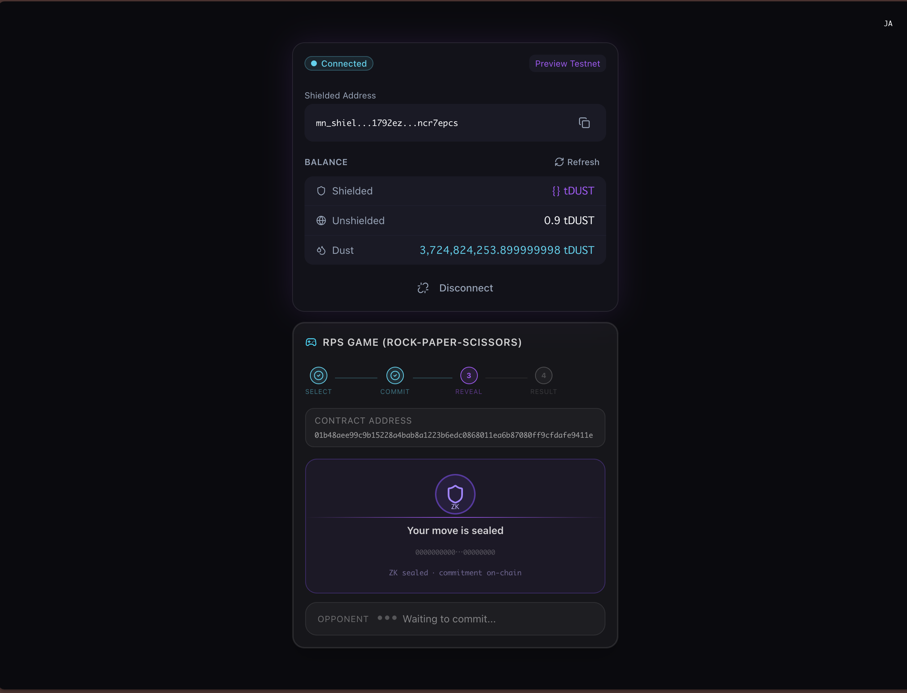
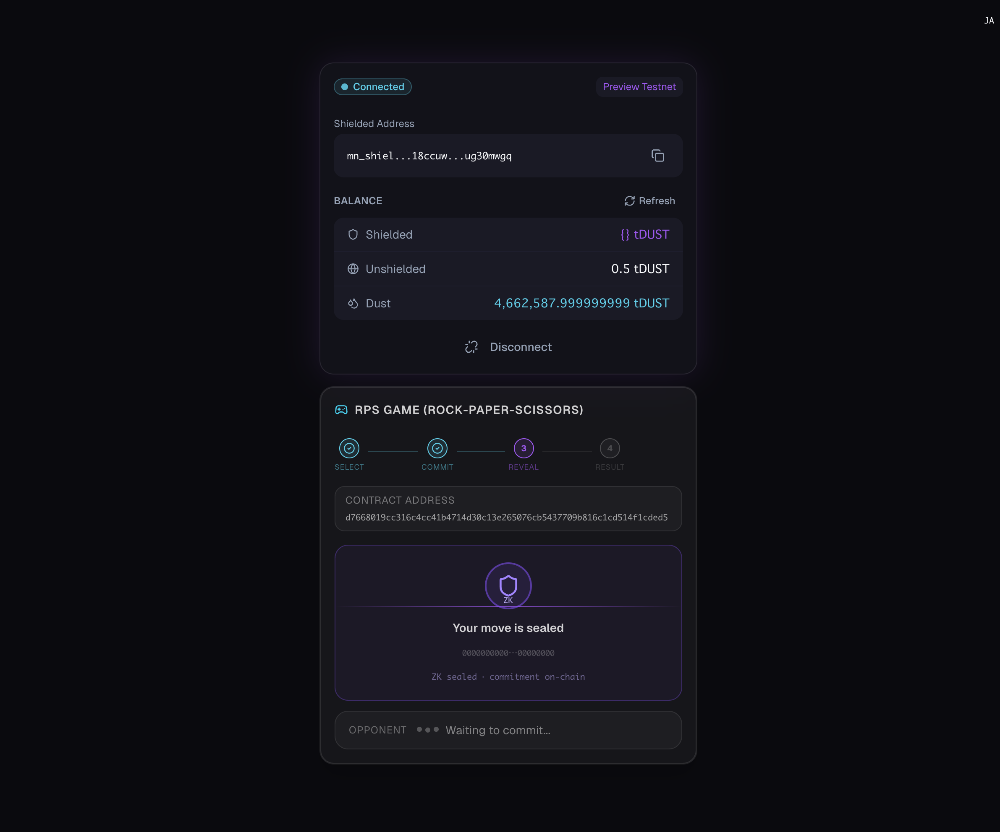
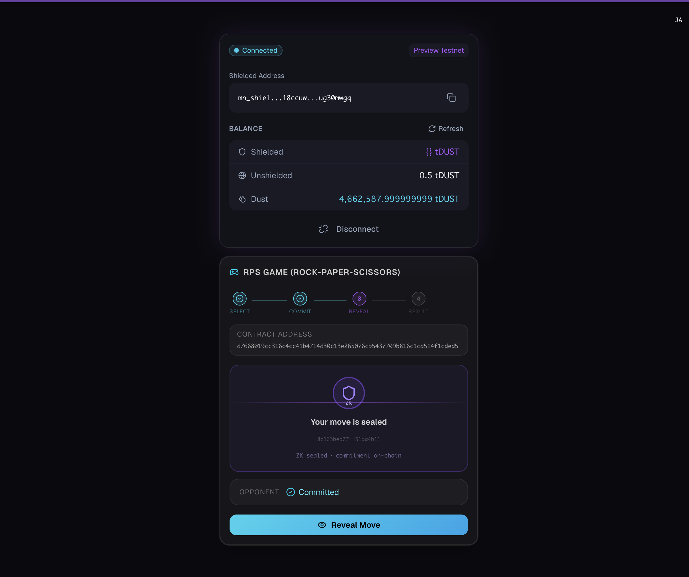
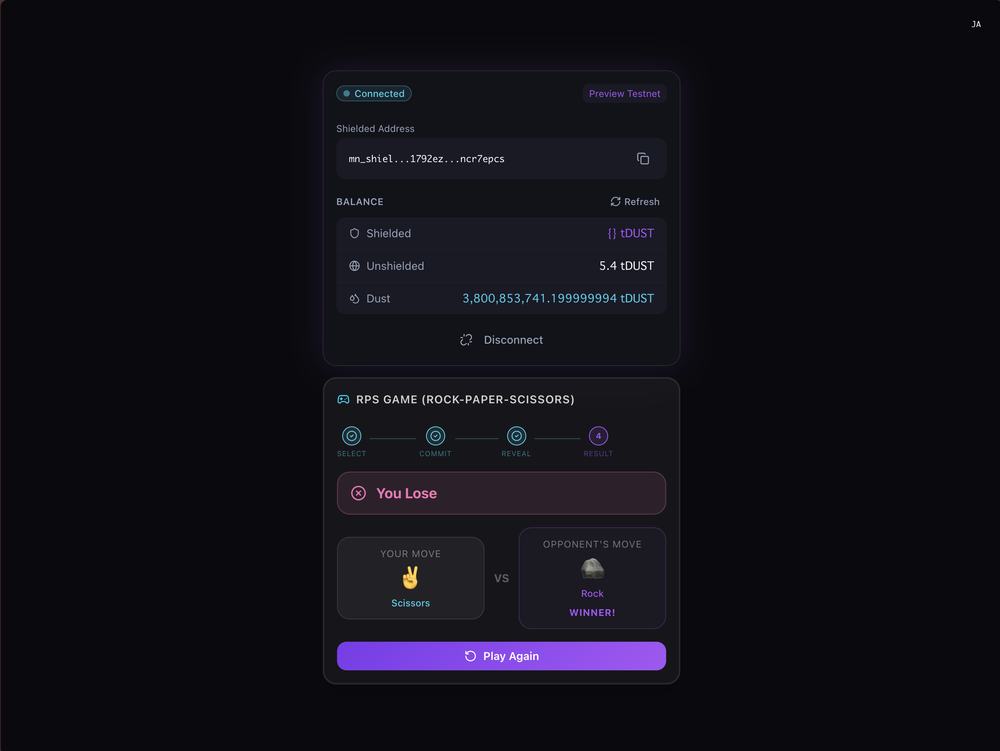
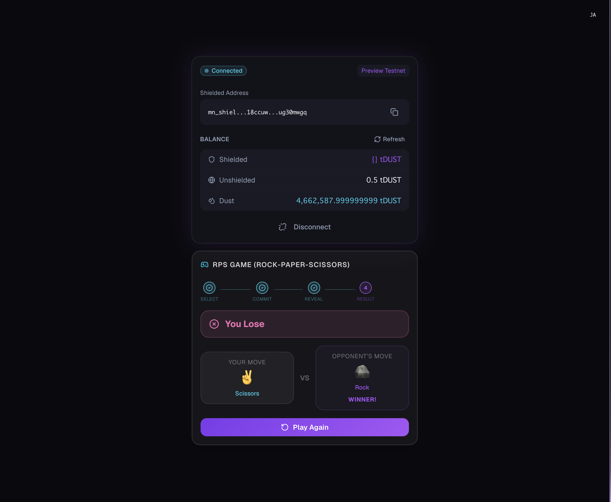
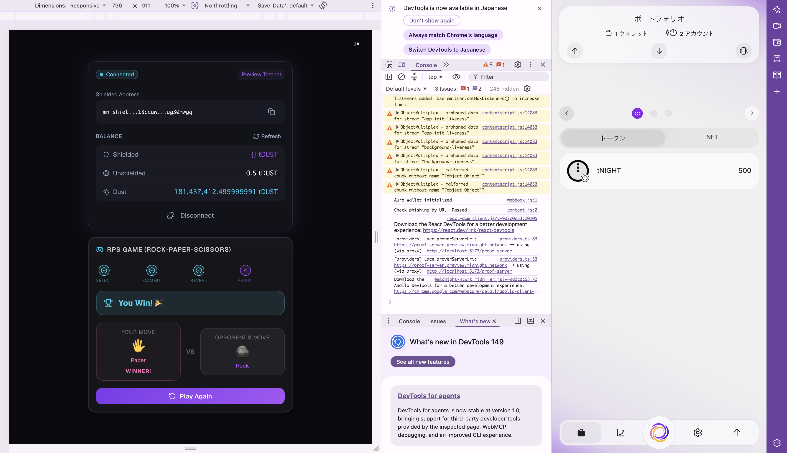
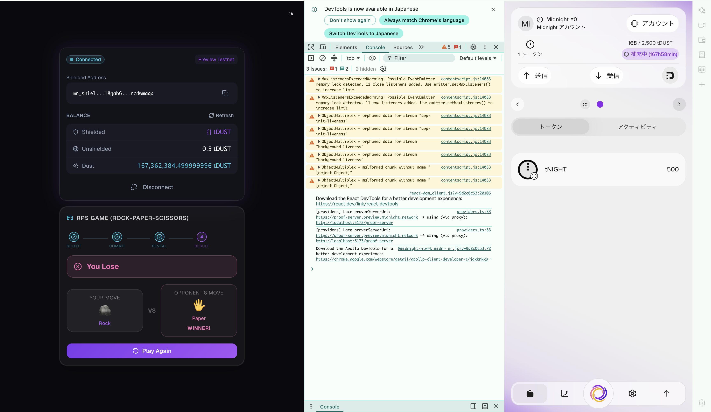

# midnight-rps-sample-app

このプロジェクトは Midnight Network 上に構築されています。

## デモ動画 - YouTube

[](https://youtu.be/jmUyDCOBVCY)

## 概要

`midnight-rps-sample-app` は、プライバシー重視のブロックチェーンである Midnight 上に構築された、じゃんけん dApp のサンプルプロジェクトです。

### 主な特徴

* **ゼロ知識証明（ZK Proof）を活用した公平なゲームプレイ**
  このアプリでは、Compact スマートコントラクトを利用した「Commit / Reveal」方式を採用しています。

  プレイヤーは、じゃんけんの手（グー・チョキ・パー）をソルトとともにハッシュ化した値として最初にコミットします。

  すべてのプレイヤーがコミットした後、それぞれの手を公開（Reveal）します。

  これにより、相手の手を見てから自分の手を変更する「後出し」のような不正ができない、公平で改ざん耐性のあるゲームを実現しています。

* **Midnight Blockchain を利用**
  スマートコントラクトは Midnight の PreProd テストネットへデプロイされ、すべてのトランザクションがオンチェーンに記録されます。

* **フルスタック構成**

  | パッケージ           | 役割                                   |
  | --------------- | ------------------------------------ |
  | `pkgs/contract` | Compact 言語で記述されたスマートコントラクト           |
  | `pkgs/shared`   | `cli` と `app` で共有するドメイン型、ネットワーク設定、定数 |
  | `pkgs/cli`      | コントラクトのデプロイおよび操作を行う CLI ツール          |
  | `pkgs/app`      | React + Vite で構築されたフロントエンド UI        |

* **Lace Wallet との統合**
  `@midnight-ntwrk/dapp-connector-api` を利用して Lace Wallet と接続し、安全な署名とトランザクション処理を行います。

### ゲームの流れ

1. **Commit フェーズ** — 各プレイヤーが、自分の手とソルトをハッシュ化した値としてブロックチェーンへコミットします（ZK Proof を生成）。
2. **Reveal フェーズ** — 両プレイヤーが、事前にコミットしていた手を公開します。
3. **Settlement（決着）** — コントラクトが結果（`player1_wins` / `player2_wins` / `draw`）を判定し、オンチェーンへ記録します。

## 環境情報

```bash
Docker version 27.4.0
compact 0.2.0        # ラッパー CLI（compactc のバージョンを管理）
compactc 0.30.0      # 実際の Compact コンパイラ — 必ずこのバージョンを使用すること
bun 1.3.13
node 23.3.0
```

> **重要**: `compact 0.2.0` はあくまで CLI ラッパーです。
> このコントラクトは **compactc 0.30.0**（言語バージョン 0.22）を使用して作成・検証されています。
>
> より新しい compactc（例: 0.31.0。言語バージョン 0.23 を出力）をインストールすると、pragma のチェックに失敗します。
>
> `compact` ラッパー CLI をインストールした後、正しい compactc のバージョンに固定してください。
>
> ```bash
> compact update 0.30.0
> ```
>
> 以下のコマンドで確認できます。
>
> ```bash
> compact list   # → 0.30.0 が有効なバージョンとして → マーク付きで表示されること
> ```

## アプリケーション画像


















## 開発方法

### Devcontainer を使用する（推奨）

このリポジトリには、事前設定済みの Devcontainer 環境が含まれています。

1. VS Code 拡張機能 `Dev Containers`（`ms-vscode-remote.remote-containers`）をインストールします。
2. VS Code でこのリポジトリを開きます。
3. コマンドパレットから `Dev Containers: Reopen in Container` を実行します。
4. コンテナの起動が完了するまで待ちます。

コンテナ作成時に、`postCreateCommand` によって `compactc 0.30.0` が自動的に固定されます。

### ブラウザへ Lace Wallet をインストール

まだ Lace Wallet をインストールしていない場合は、以下のページから Lace Wallet をインストールしてください。

https://www.lace.io/

次に、Midnight 用のウォレットアカウントを作成する必要があります。

> PreProd Network に切り替えてください。

### インストール

```bash
bun install
```

### ビルド

最初に Compact コントラクトをコンパイルします。

```bash
bun contract compact
```

次に、すべての TypeScript パッケージをビルドします（contract → ZK キー同期 → shared → CLI → app）。

```bash
bun run build
```

`bun run build` コマンドでは、以下の処理が順番に実行されます。

1. `pkgs/contract` — TypeScript のコンパイル + `managed/` を `dist/` へコピー
2. コントラクトから ZK キー / Circuit を `pkgs/app/public/` へ同期
3. `pkgs/shared` — TypeScript のコンパイル
4. `pkgs/cli` — TypeScript のコンパイル
5. `pkgs/app` — Vite によるビルド

### Proof Server を起動する

```bash
docker compose -f pkgs/cli/proof-server.yml up
```

> **提供されている Devcontainer を使用している場合**
>
> Devcontainer では Docker-in-Docker を使用するのではなく、ホスト側の
> `/var/run/docker.sock` を bind mount する Docker-outside-of-Docker 構成になっています。
>
> そのため、上記コマンドで起動したコンテナは独立した Docker ネットワーク上で動作し、Devcontainer 内から `127.0.0.1:6300` ではアクセスできません。
>
> この場合、`cli` / `app` では以下のようなエラーが発生します。
>
> `ECONNREFUSED 127.0.0.1:6300`
>
> または
>
> `"Failed to prove transaction"`
>
> Devcontainer を利用する場合は、代わりに Devcontainer 専用の compose ファイルを使用してください。
>
> この compose ファイルでは、Proof Server と Devcontainer が同じネットワーク名前空間を共有します。
>
> ```bash
> DEVCONTAINER_HOST_ID=$HOSTNAME docker compose -f pkgs/cli/proof-server.devcontainer.yml up
> ```
>
> `bun cli preprod-ps` / `bun cli preview-ps` は、この処理を自動で行います。
>
> `REMOTE_CONTAINERS=true` を検出すると、適切な compose ファイルが自動選択されます。
>
> そのため、Devcontainer 内では
>
> `bun cli preprod` / `preview`
>
> と手動で Proof Server を起動する方法よりも、
>
> `bun cli preprod-ps` / `bun cli preview-ps`
>
> を利用することを推奨します。

### PreProd Network へコントラクトをデプロイする

テストネット用の NIGHT Token を持っていない場合は、以下のサイトから取得できます。

https://faucet.preprod.midnight.network/

```bash
bun cli preprod
```

> 2回目以降は、以下のコマンドを実行してください。

```bash
bun cli preprod-ps
```

デプロイ済みコントラクトアドレス情報（PreProd Network）

```bash
╔══════════════════════════════════════════════════════════════╗
║                                                              ║
║              Midnight RPS Example                            ║
║              ─────────────────────                           ║
║              Rock-Paper-Scissors with ZK commit-reveal       ║
║                                                              ║
╚══════════════════════════════════════════════════════════════╝
.
.
.
[19:24:25.997] INFO (40223): Deploying RPS contract...
  ⠇ Deploying RPS contract[19:24:51.416] INFO (40223): Deployed RPS contract at: 23149945fed06aa010cc3e48e9f5df91625567300fae4e09371bb788d07a6bd8
  ✓ Deploying RPS contract
  Contract deployed at: 23149945fed06aa010cc3e48e9f5df91625567300fae4e09371bb788d07a6bd8
```

### Preview Network へコントラクトをデプロイする

Preview は PreProd よりも軽量な公開テストネットです。

過去のイベント数が少ないため、ウォレットの同期をより高速に行えます。

テストネット用 NIGHT Token を持っていない場合は、以下のサイトから取得できます。

https://faucet.preview.midnight.network/

```bash
bun cli preview
```

> 2回目以降は、以下のコマンドを実行してください。

```bash
bun cli preview-ps
```

デプロイ済みコントラクトアドレス情報（Preview Network）

```bash
╔══════════════════════════════════════════════════════════════╗
║                                                              ║
║              Midnight RPS Example                            ║
║              ─────────────────────                           ║
║              Rock-Paper-Scissors with ZK commit-reveal       ║
║                                                              ║
╚══════════════════════════════════════════════════════════════╝
.
.
.
[09:47:53.729] INFO (82390): Deploying RPS contract...
  ⠋ Deploying RPS contract[09:48:16.409] INFO (82390): Deployed RPS contract at: 9070775f7615e1598dc8642398453d7d4bb9cd0939c06019849f5ec80ef5ee5c
  ✓ Deploying RPS contract
  Contract deployed at: 9070775f7615e1598dc8642398453d7d4bb9cd0939c06019849f5ec80ef5ee5c
```

### CLI からじゃんけんを操作する

```bash
──────────────────────────────────────────────────────────────
  RPS Actions                         DUST: 3,497,759,478,999,999,996
  Contract: 23149945fed06aa010cc3e48e9f5df91625567300fae4e09371bb788d07a6bd8
──────────────────────────────────────────────────────────────
  [1] Commit my move
  [2] Reveal my move
  [3] Show game state
  [4] Exit
──────────────────────────────────────────────────────────────
> 1

──────────────────────────────────────────────────────────────
  Select your move
──────────────────────────────────────────────────────────────
  [1] Rock     🪨
  [2] Paper    🖐
  [3] Scissors ✌️
──────────────────────────────────────────────────────────────
> 1
[19:36:19.509] INFO (40223): Committing move 0...
  ⠸ Committing move (Rock) — generating ZK proof[19:36:45.473] INFO (40223): Commit TX 0072b7ad5d6127b3e6d02373ccd967c7329b2ca7a8be35d099f44ebb6736728cca added in block 618227
  ✓ Committing move (Rock) — generating ZK proof

──────────────────────────────────────────────────────────────
  RPS Actions                         DUST: 3,503,362,116,999,999,995
  Contract: 23149945fed06aa010cc3e48e9f5df91625567300fae4e09371bb788d07a6bd8
──────────────────────────────────────────────────────────────
  [1] Commit my move
  [2] Reveal my move
  [3] Show game state
  [4] Exit
──────────────────────────────────────────────────────────────
> 2
[19:37:05.494] INFO (40223): Revealing move...
  ⠇ Revealing move — generating ZK proof[19:37:33.105] INFO (40223): Reveal TX 00ba3dd2c40736337619c979afeb2210d8b36fc917a93e403a90b1378f07eb680e added in block 618235
  ✓ Revealing move — generating ZK proof

──────────────────────────────────────────────────────────────
  RPS Actions                         DUST: 3,503,458,932,999,999,994
  Contract: 23149945fed06aa010cc3e48e9f5df91625567300fae4e09371bb788d07a6bd8
──────────────────────────────────────────────────────────────

──────────────────────────────────────────────────────────────
  RPS Actions                         DUST: 3,504,021,088,999,999,994
  Contract: 23149945fed06aa010cc3e48e9f5df91625567300fae4e09371bb788d07a6bd8
──────────────────────────────────────────────────────────────
  [1] Commit my move
  [2] Reveal my move
  [3] Show game state
  [4] Exit
──────────────────────────────────────────────────────────────
> 3
[19:38:49.770] INFO (40223): Checking RPS ledger state...
[19:38:50.631] INFO (40223): RPS state: {"state":2,"game_over":true,"p1_key":"0xc3625c1f...","p2_key":"0x12c4698e...","p1_joined":true,"p2_joined":true,"p1_commit":"0x9accc673...","p2_commit":"0x7516506b...","p1_revealed":true,"p2_revealed":true,"p1_move":1,"p2_move":0,"result":1}

  Game State:   finished
  Game Over:    true
  P1 Joined:   true
  P2 Joined:   true
  P1 Revealed: true
  P2 Revealed: true
  Result:       player1_wins


──────────────────────────────────────────────────────────────
  RPS Actions                         DUST: 3,504,095,491,999,999,994
  Contract: 23149945fed06aa010cc3e48e9f5df91625567300fae4e09371bb788d07a6bd8
──────────────────────────────────────────────────────────────
  [1] Commit my move
  [2] Reveal my move
  [3] Show game state
  [4] Exit
──────────────────────────────────────────────────────────────
```

### フロントエンドアプリを起動する

```bash
bun app dev
```

> Devcontainer を使用する場合は、以下のコマンドを実行してください。

```bash
bun app dev --host
```

1. 事前に、異なる2つのブラウザへ Lace Wallet 拡張機能をインストールします。
   例えば Brave の利用を推奨します。
   それぞれのブラウザでウォレットを1つずつ作成してください。

2. Faucet からテスト用 tNight を取得し、それぞれのウォレットへ送金します。

3. `bun app dev` コマンドでアプリケーションを起動し、それぞれのブラウザから `localhost:5173` へアクセスします。

4. ウォレットを接続します。

5. CLI を使ってデプロイしたコントラクトのアドレスを入力します。

6. それぞれのブラウザで自分の手を選択し、送信します。

7. それぞれのブラウザで Reveal ボタンをクリックします。

8. それぞれのブラウザにゲーム結果が表示されます。

   * Reveal の順番は Commit の順番と一致させる必要があります。
   * 例えば Wallet A → Wallet B の順で Commit した場合、Reveal も Wallet A → Wallet B の順で行う必要があります。
